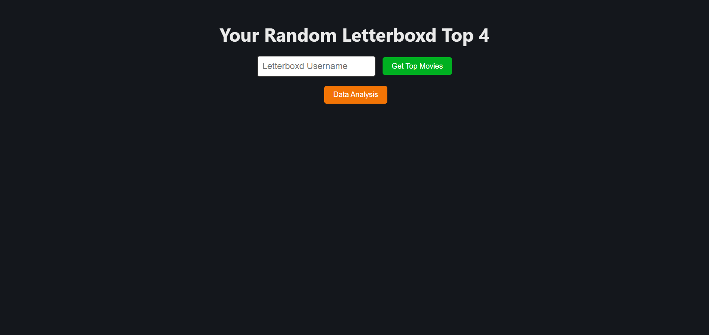
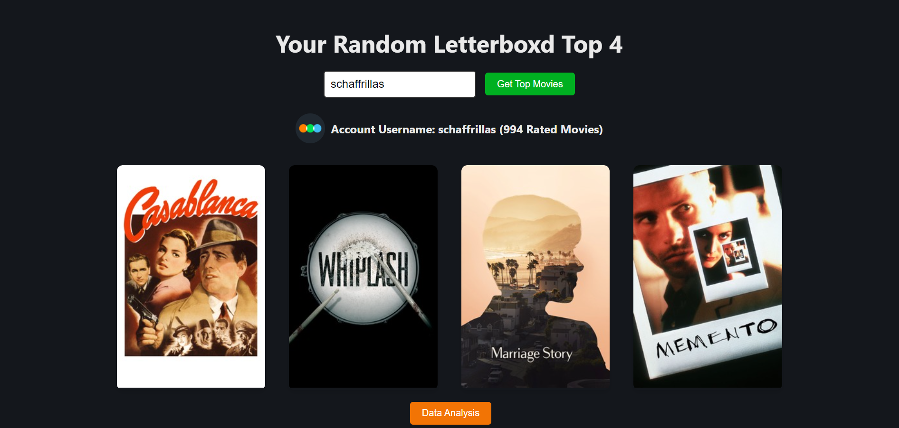
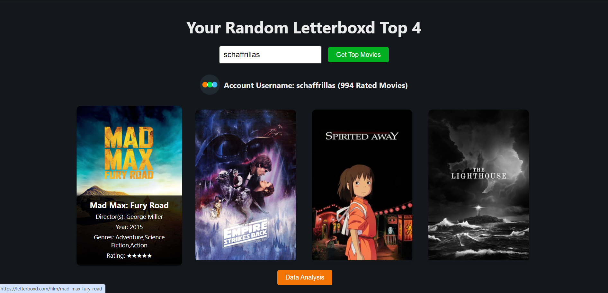
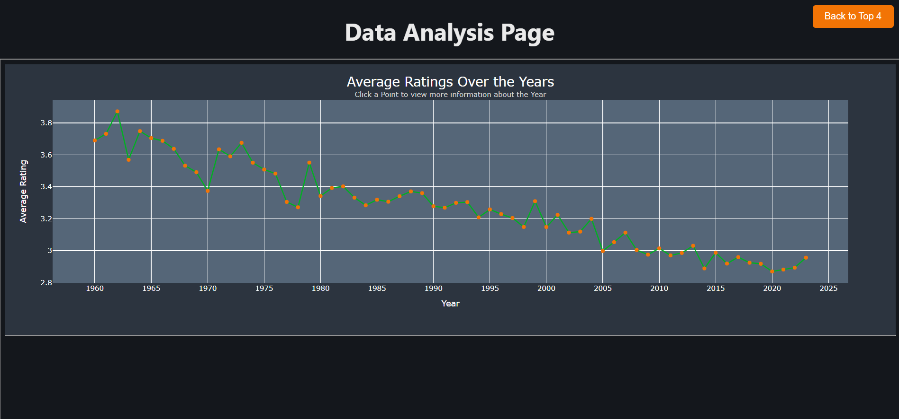
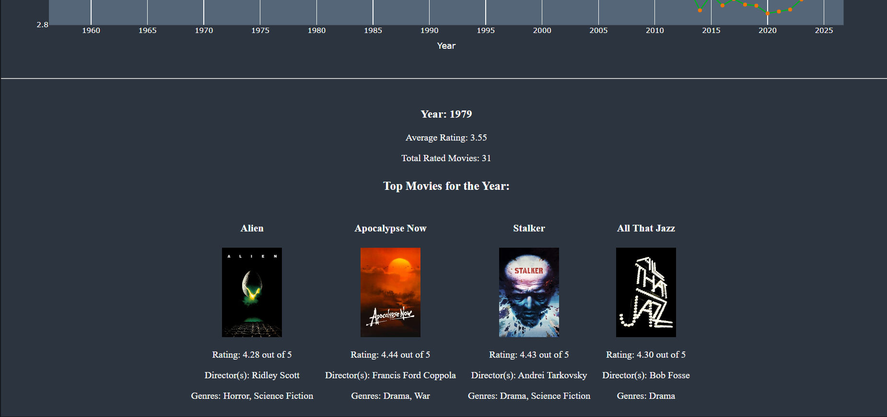
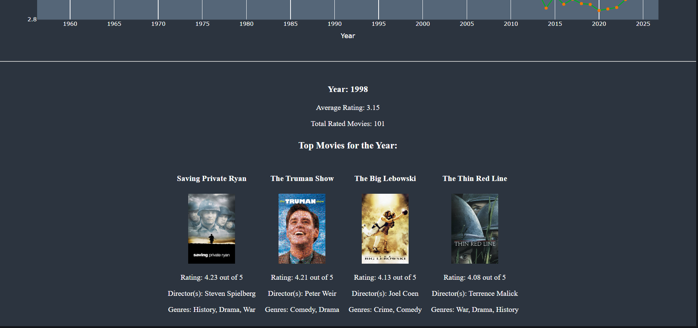
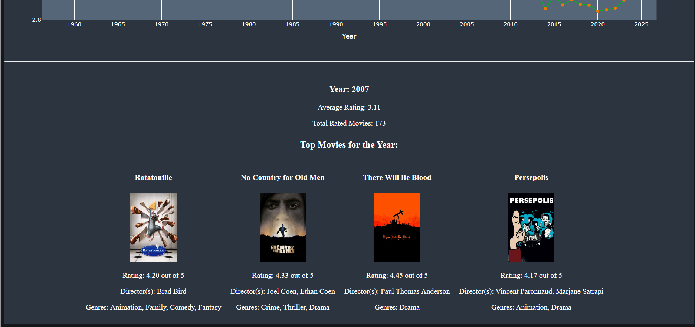

# Your Letterboxd Top 4

## Overview

This Full-Stack project was created with a Python backend and a React.js frontend with Flask and Dash libraries to create a web application that provides users with a personalized top 4 selection of their top-rated movies on Letterboxd, along with a data analysis feature showcasing the top 4 movies and the average ratings over the years.

## Features

- **Get Top Movies**: Enter your Letterboxd username, and the app fetches your top-rated movies, displaying information such as title, year, director(s), genres, and rating. It randomly selects four movies and displays them.

- **Data Analysis**: Explore average ratings over the years with an interactive line graph. Click on points to view more information about a specific year, including average rating, total rated movies, and a list of top movies.

- **Responsive Design**: The application features a responsive design that adapts to various screen sizes.

## Usage

1. Enter your or any Letterboxd username in the search box.

2. Click the "Get Top Movies" button to view your top-rated movies.

3. Explore the "Data Analysis" section to visualize average ratings over the years. Click any year to view the top 4 rated movies of the year. 

## Getting Started

1. Install the required Python packages listed in the requirements.txt:


2. Run the Flask application:

    ```bash
    python app.py
    ```

   ```bash
   python analysis.py
   ```

   ```bash
   npm start
   ```

3. Open the application in your web browser (by default, it runs at [http://localhost:3000](http://localhost:3000)).

## Technologies Used

- React
- Python
- Flask
- Dash
- Plotly Express
- HTML, CSS, JavaScript


## Visualization

The Home Page:


Searching a user (I chose a random top Letterboxd Reviewer as an example):


Hovering over a movie (Can be clicked to see the full Letterboxd page and the Username can be clicked too to view the profile):


Now clicking the Data Analysis page for the Data Science section of the movie changes throughout the years. The main plot:


Clicking a Year to view more information, 1979 in this example:


1998:


2007:

